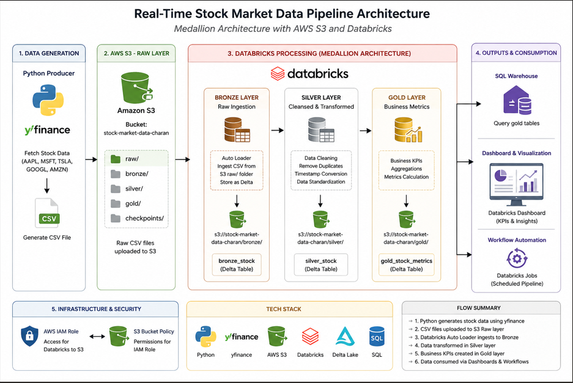
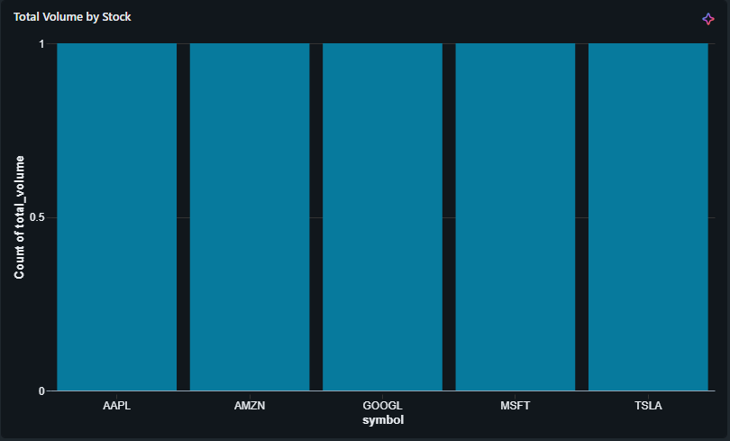
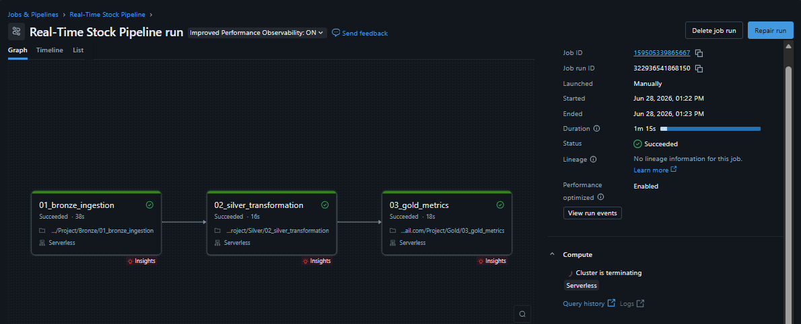

````markdown
# Real-Time Stock Market Data Pipeline

## Project Overview

This project implements a real-time stock market data pipeline using AWS S3 and Databricks following the Medallion Architecture (Bronze, Silver, and Gold layers).

Stock market data is generated using Python and the Yahoo Finance API, stored in Amazon S3, processed in Databricks, and visualized using Databricks Dashboards. The pipeline is automated using Databricks Jobs scheduled to run every 5 minutes.

---

## Architecture



## Work Flow 

```text
Python Producer
        ↓
AWS S3 (Raw Layer)
        ↓
AWS S3 (Bronze Layer)
        ↓
AWS S3 (Silver Layer)
        ↓
AWS S3 (Gold Layer)
        ↓
AWS S3 (Checkpoints)
        ↓
Databricks Processing (Bronze → Silver → Gold)
        ↓
Databricks Dashboard
        ↓
Databricks Job Scheduler (Every 5 Minutes)
````

---

## Tech Stack

* Python
* Yahoo Finance API
* AWS S3
* AWS IAM
* AWS CLI
* Databricks
* PySpark
* Delta Lake
* SQL
* Databricks Workflows
* Git & GitHub

---

## Project Workflow

1. Generate stock market data using Python.
2. Upload data to AWS S3 (Raw Layer).
3. Store and organize data in AWS S3 Bronze, Silver, Gold, and Checkpoint layers.
4. Ingest raw data into the Bronze layer using Databricks Auto Loader.
5. Clean and transform data in the Silver layer.
6. Create business KPIs in the Gold layer.
7. Visualize KPIs using Databricks Dashboard.
8. Create a Databricks Workflow to automate notebook execution.
9. Schedule the workflow to run automatically every 5 minutes.

---

## Dashboard Screenshots

Screenshots Added inside the `images/` folder.








---

## Project Structure

```text
real-time-stock-market-pipeline/
│
├── producer/                 # Python producer scripts
├── notebooks/                # Databricks notebooks
├── sql/                      # SQL queries for KPIs
├── architecture/             # Architecture diagrams
├── images/                   # Dashboard screenshots
├── docs/                     # Project documentation
├── README.md
```

---

## Future Enhancements

* Integrate Kafka for real-time streaming.
* Implement CI/CD using GitHub Actions.
* Add monitoring and alerting.
* Deploy dashboards using BI tools.

```
```
